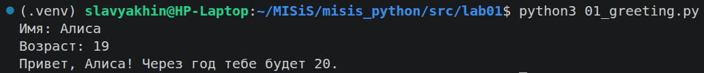
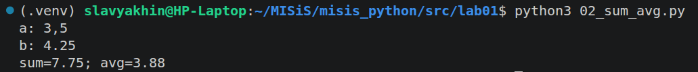
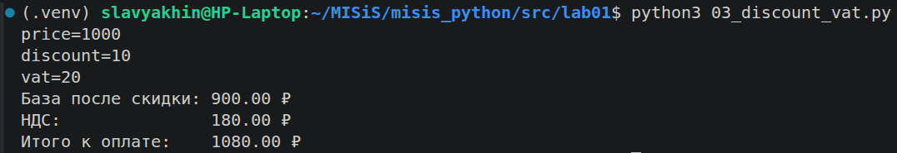
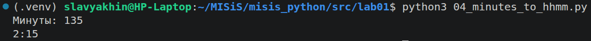
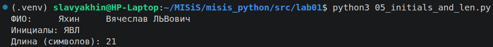
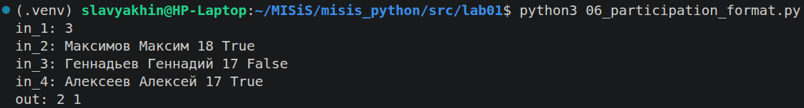
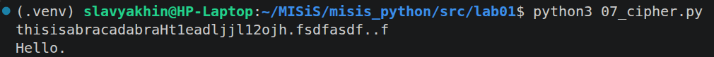

# ЛР1 — Ввод/вывод и форматирование
print, f-string

## 01_greeting
Программа принимает на вход две строки: имя и возраст, возраст преобразуется в целочисленный тип. Затем полученные значения выводятся в составе f-строки.

## 02_sum_avg
Скрипт получает от пользователя два вещественных числа. До преобразования полученной строки в тип с плавающей точкой, в ней заменяются символы ',' на '.'. Потом числа выводятся в f-строке, учитывая требуемое количество десятичных знаков.

## 03_discount_vat
Программа принимает три вещественных числа в одной строке, каждое предваряется именем и знаком равно ('='), пары разделены запятой (','). 

## 04_minutes_to_hhmm
На ввод подаётся целое m - число минут. Программа вычисляет количество часов и остаток минут при помощи операторов целочисленного деления '//' и '%'

## 05_initials_and_len
Пользователь вводит строку - фио, допускаются повторые разделительные символы - ' ', '\t', '\n', '\r', '\v', '\f'. (см. str.isspace()). Затем на стандартный поток вывода (sys.stdout) подаются инициалы, полученные в качестве первого символа каждого введенного слова. Второй строкой выводится количество символов в изначальной строке без "лишних" разделителей (с одним на каждое слово, кроме полследнего)

## 06_participation_format
Первой строкой подают n - число последующих строк в вводе. Затем, в каждой из n строк вписывают строки в формате "Фамилия Имя Возраст Формат_участия(True / false). В цикле подщитывается количество строк с true (допускаются символы разного регистра).

## 07_cipher
Цвет строки приглашения задаётся ANSI escape-последовательностью "\\033\[34m\]".

На вход подаётся последовательность символов - "шифр". Последовательность переберается курсором i (целочисленной переменной), без помощи методов find(). Программа находит первый символ исходного текста - заглавную букву, и следующий за цифрой второй символ. Остальные символы находятся на равном удалении друг от друга. Исходный текст обязан оканчиваться точкой '.'.

