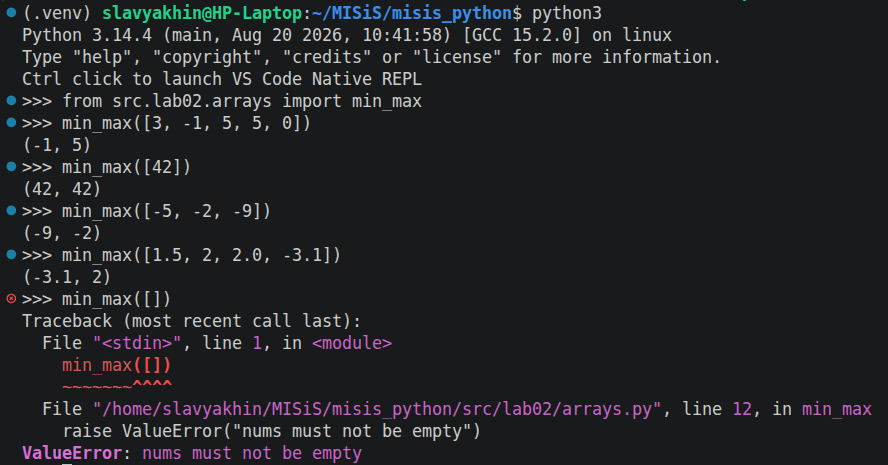
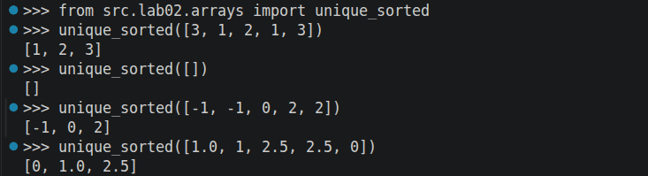
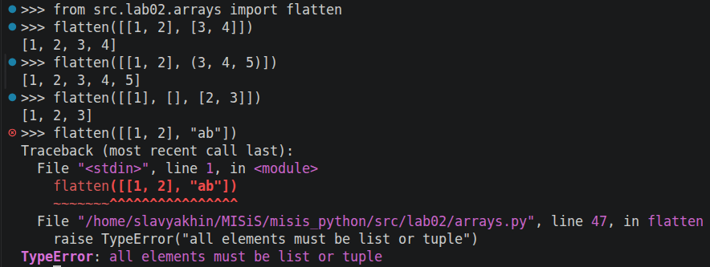
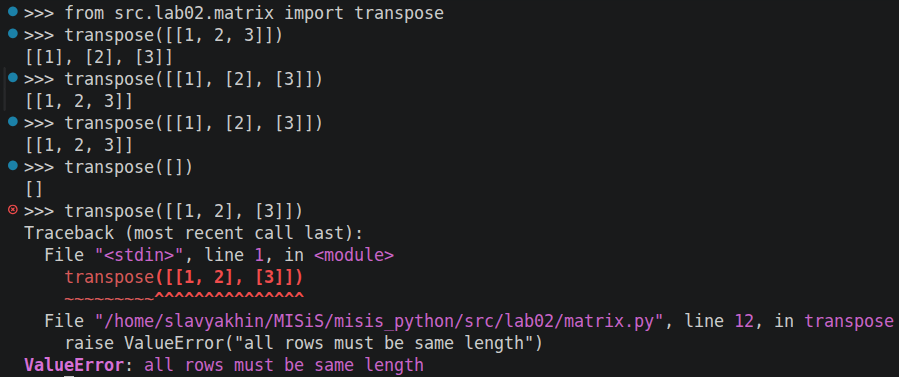
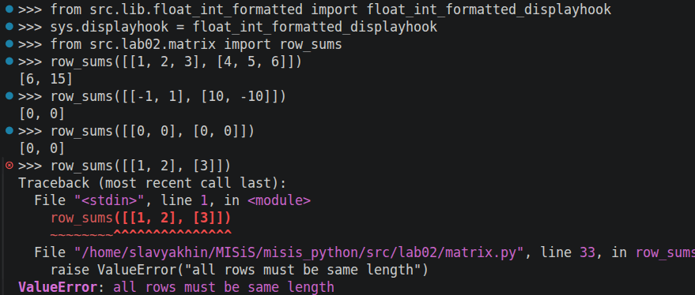
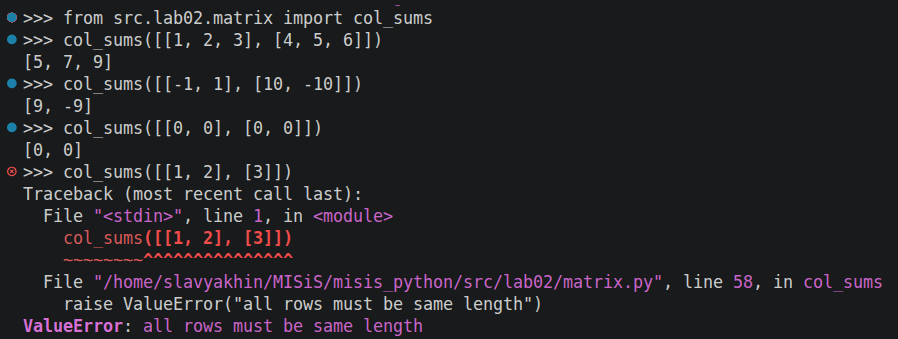
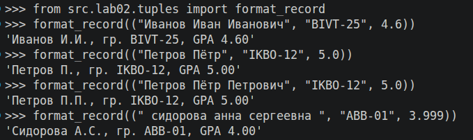

# ЛР2 — Коллекции и матрицы (list/tuple/set/dict)

Репозиторий переведен на модульную архитектуру для удобного запуска тестов, импорта переиспользуемых функций. Добавлены файлы **\_\_init\_\_.py**, обозначающие модуль.

Переиспользуемые функции сохранены в **src/lib**.

Для тестирования выбран фреймворк **pytest**. Для запуска тестов `python3 -m pytest tests/lab02` (из корня проекта).

## Задание 1 — `arrays.py`

Реализованы три функции:

### 1. `min_max(nums: list[float | int]) -> tuple[float | int, float | int]`
Сперва принимает первый елемент за максимум и минимум. Затем в цикле перебирает каждый элемент и сравнивает с текущим результатом, выбирая самый маленьких и самый большой элементы в списке.

### 2. `unique_sorted(nums: list[float | int]) -> list[float | int] `
Уникальность элементов достигается явным приведением списка к set и обратно - неупорядоченному набору уникальных элементов (хэш-таблица). Затем список сортируется при помощи сортировки слиянием, дополнительно реализованной в src.lib.merge_sort.

### 3. `flatten(mat: list[list | tuple]) -> list`
Сериализация матрицы. В двух циклах перебираются все элементы матрицы и поочередно добавляются в результирующий список.

В каждой функции проверяется тип вводимых значений: тип коллекции и каждого их элемента. min_max дополнительно поднимает `ValueError` при пустом списке на входе.

## Задание B — `matrix.py`

Создарны три фукции:

### 1. `transpose(mat: list[list[float | int]]) -> list[list]`
Транспонирование матрицы. Строго проверяются типы входного списка. Результат - новый список списков, созданный при помощи генераторов.

### 2. `row_sums(mat: list[list[float | int]]) -> list[float]`
Функция возвращает вектор - суммы элементов в строках. Строго проверяются типы входного списка. Результат формируется в заранее подготовленном списке длины столбца.
\
\
Заметим, что стандартный вывод в REPL не точно совпадает с требуемым результатам - целые числа сопровождаются лишними нулями в десятичной части. Чтобы выводить целые `float` без нулей, напишем обертку над `float` `FloatIntFormatted` (поменям `__repr__`) и `displayhook` к нему, который будет проверять, является ли число целым. Обёртку можно найти в _lib/float_int_formatted.py_

### 3. `col_sums(mat: list[list[float | int]]) -> list[float]`
Функция возвращает вектор - суммы элементов в столбцах. Строго проверяются типы входного списка. Результат формируется в заранее подготовленном списке длины строки.

## Задание C — `tuples.py`
Создан _type alias_ на кортеж (см. PEP 695 pytohn 3.12) `Rec` - тип записи студента.
\
\
`format_record(rec: Rec) -> str`\
возвращает строку вида\
`Иванов И.И., гр. BIVT-25, GPA 4.60`
Строго проверяются типы входной записи. Проверяется попадает ли _gpa_ в отрезок [0.0, 5.0].\
В ФИО полной остаётся только фамилия, с первой заглавной и остальными строчными буквами (методы `lower()` и `upper()`). К фамилии добавляются инициалы имени и отчества (при наличии) конкатенацией строк оператором сложения `+`.

