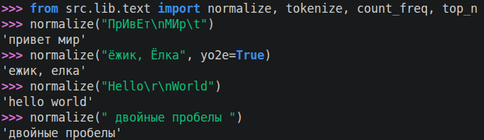
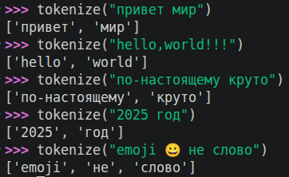
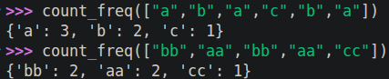
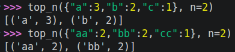
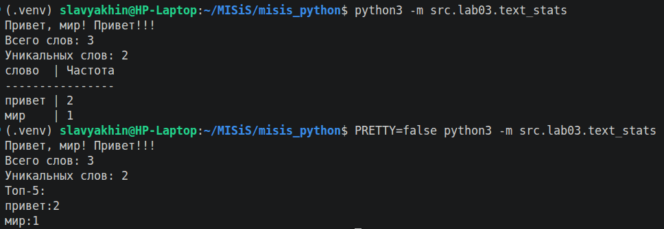

# ЛР3 — Тексты и частоты слов (словарь/множество)

## Задание A — `src/lib/text.py`
 
Реализованы четыре функции:

### 1. `normalize(text: str, *, casefold: bool = True, yo2e: bool = True) -> str`
Нормализует текст, символы приводятся к одинаковому регистру при помощи `casefold()` по умолчанию или `lower()` - по требованию. По умолчанию заменяются буквы ё на е, методом `replace()`. Убираются все нестандартные символы-разделители, повторяющие пробелы сокращаются до одного - `' '.join(text.split()).`

``` python
    if casefold:
        text = text.casefold()
    else:
        text = text.lower()

    if yo2e:
        text = text.replace('ё', 'е')

    text = ' '.join(text.split())
```


### 2. `tokenize(text: str) -> list[str]`
Функция преобразует строку в список токенов - подстрок, удовлетворяющих шаблону **r'\w+(?:-\w)*'** (r - обозначает raw-string, символ '\\' в такой строке не считается управляющим). Используется `re.findall`.
``` python
   tokens = findall(TOKEN_PATTERN, text)
```


### 3. `count_freq(tokens: list[str]) -> dict[str, int]`  
Создаёт словарь (ключ-значение), сопостовляет каждому уникальному токену количество его появлений. Перебераются все неуникальные токены списке, инкрементируется значение в словаре по токену-ключу. Если токен встречается впервые, благодаря безопасному доступу `get`, устанавливается значение по-умолчанию - 0.
``` python
    freqs = dict()

    for token in tokens:
        freqs[token] = freqs.get(token, 0) + 1
```


### 4. `top_n(freq: dict[str, int], n: int = 5) -> list[tuple[str, int]]`
Принимает словарь частот и создаёт по нему список самых популярных токенов. Список получается приведением `list()` из словаря кортежей (ключ, значение) - значения метода `items()`. Упорядочивается список сортировкой слиянием из lib, которая была доработана.

Теперь `merge_sorted()` работает с любыми сравнимыми объектами, принимает key функцию (не компаратор), добавлен `reverse` аргумент.
``` python
    top_list = list(freq.items())

    top_list = merge_sorted(top_list, key=lambda x: x[0])
    top_list = merge_sorted(top_list, key=lambda x: x[1], reverse=True)

    return top_list[:n]
```


## Задание B — `src/text_stats.py` (скрипт со stdin)

Выводит статистику о тексте в stdin один раз.

Скрипт читает весь поток вывода построчно, пока не будет подан сигнал EOF.

``` python
    tokens = list()
    for line in sys.stdin:
        tokens.extend(tokenize(normalize(line)))

    freq = count_freq(tokens)
    table = top_n(freq, n=N)
```
Формат вывода:
1. `Всего слов: <N>`  
2. `Уникальных слов: <K>`  
3. `Топ-5:` — по строке на запись в формате `слово:кол-во` (по убыванию, как в `top_n`).

Переменная окружения `PRETTY` позволяет отключить "красивый" табличный вывод. Достаточно задать значение, отличное от 'true', 'yes', 'y', '1', 't'.
``` python
    for pair in table:
        print(f'{pair[0]:<{word_col_width}}{"|":^{DIVIDER_WIDTH}}{pair[1]:<{FREQ_COL_WIDTH}}')
```

